# Architecture Diagrams (Mermaid)

These diagrams are aligned with the current ADR pack and edge/runtime constraints.

## 1) Bounded Context Map

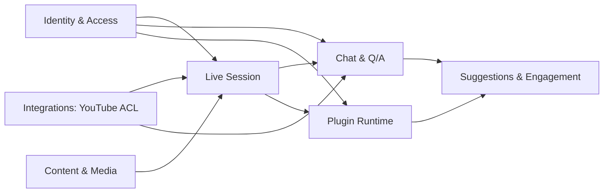

## 2) Clean Architecture Layers

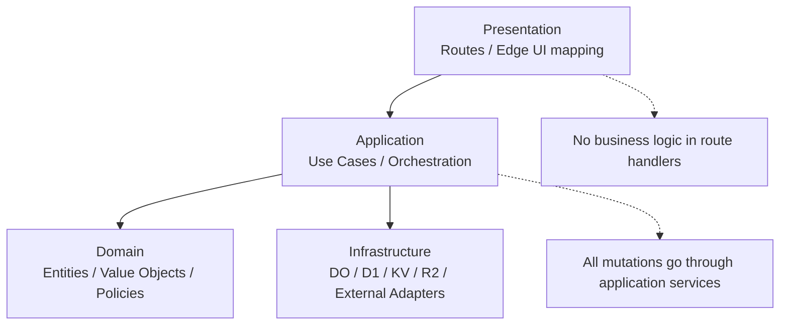

## 3) Realtime Flow with Durable Objects

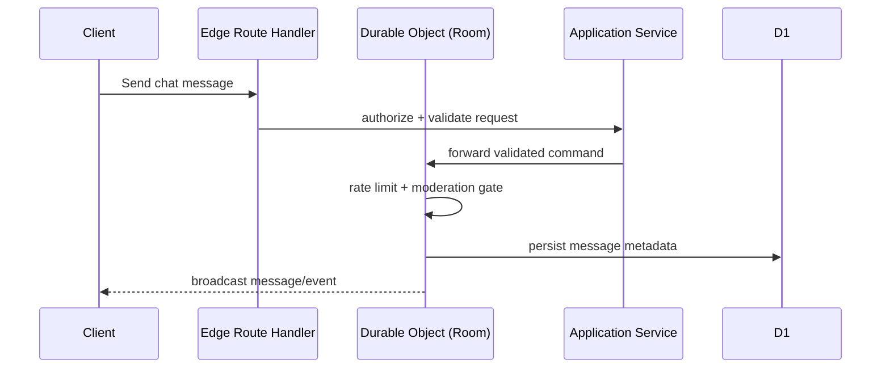

## 4) Storage Responsibilities

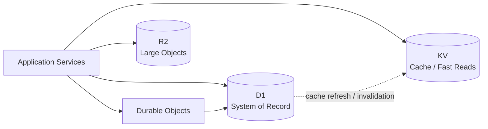

## 5) RBAC Enforcement Path

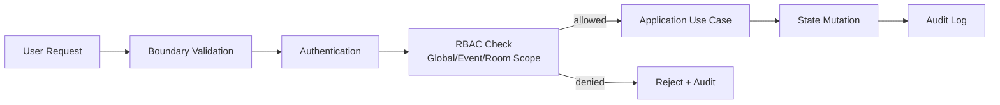

## 6) Plugin Lifecycle and Isolation

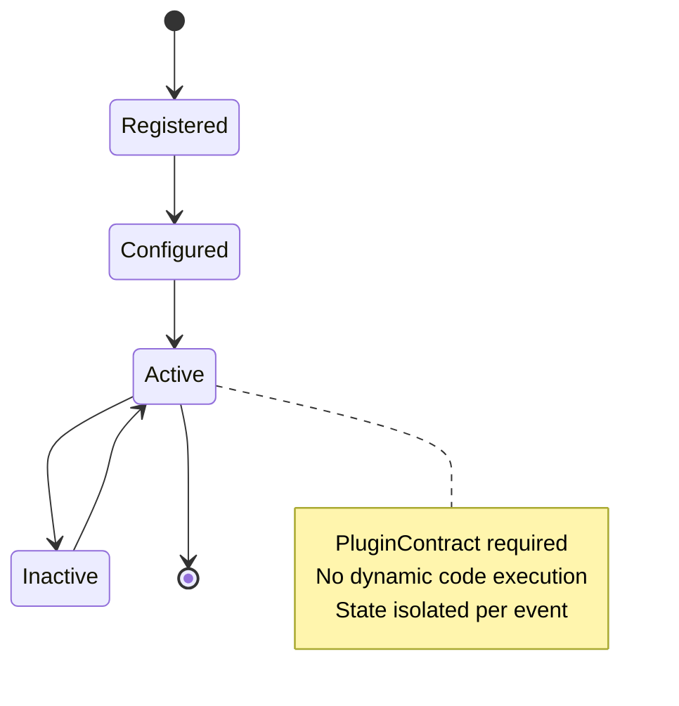

## 7) YouTube Integration Boundary (ACL)

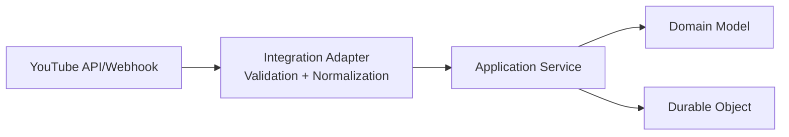

## 8) C4 - Level 1 (System Context)

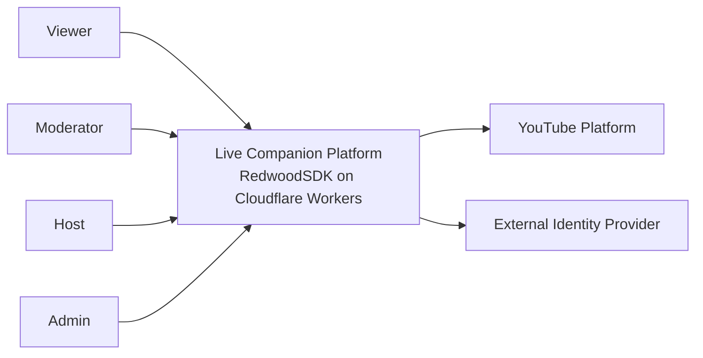

## 9) C4 - Level 2 (Container)

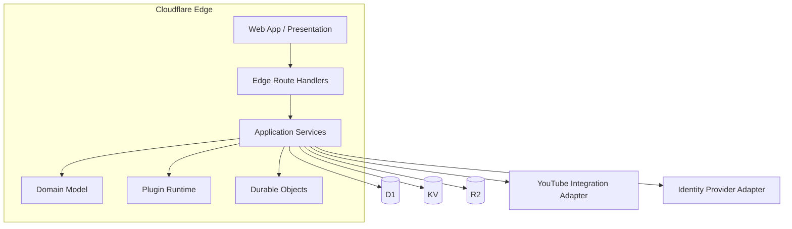

## 10) C4 - Level 3 (Component: Realtime + Chat/QA)

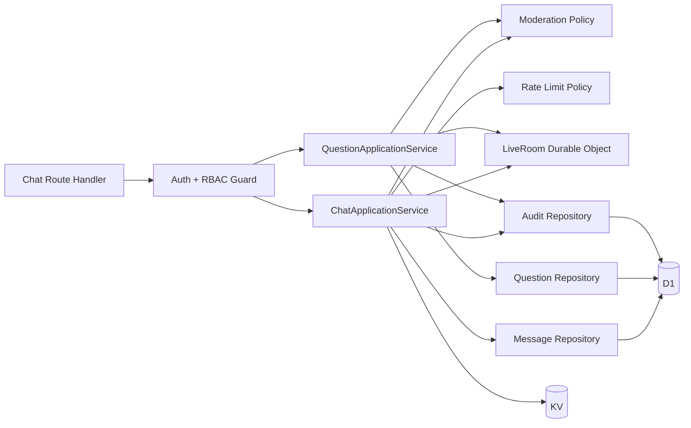

## 11) C4 - Level 4 (Deployment / Runtime View)

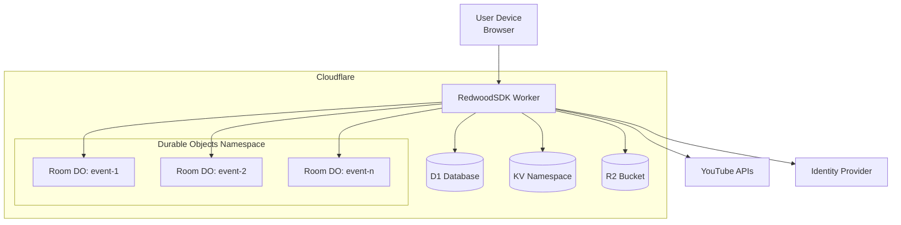
